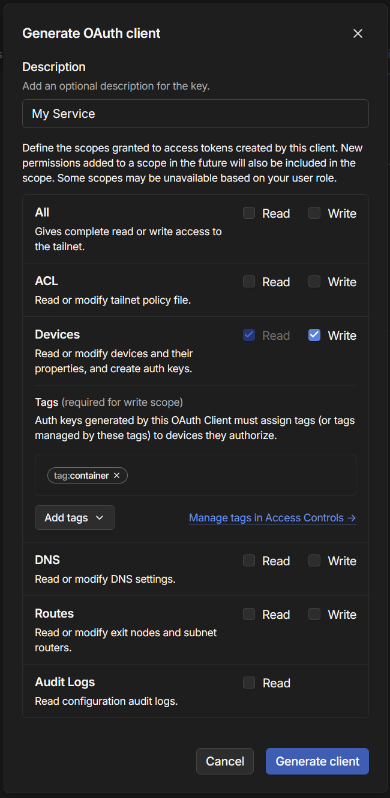

I should start with a disclaimer, please for the love of god, do not use this setup for production use. This article is for educational purposes only!

# The Problem

My AWS free trial is expiring, and I have some non-static or serverless website hosted there with virtually no traffic. Now a sane person would either: (1) drop the projects, (2) start paying $7.2 per month to Amazon, or (3) switch hosts. I didn't want to drop the projects, and it was definitely not worth to pay the monthly fee, so I decided to switch to something I already had: my server I have at home.

I started the migration and I quickly found out that I do not have an external IP address. Looking into it, I also seem to have no means of getting one either.

Thinking outside the box for a sec I decided to rent with a cheap VM from a local provider for ~$2 a month to act as a proxy with an external IP address. Idea is that if I can make a VPN tunnel, I can set up a reverse-proxy on the device and forward the requests within the VPN.

Simple, I install tailscale and then run...

```
wgengine.NewUserspaceEngine(tun "tailscale0") error: tstun.New("tailscale0"): CreateTUN("tailscale0") failed; /dev/net/tun does not exist
```

Oh... is module there?

```bash
$ sudo modprobe tun
# modprobe: FATAL: Module tun not found in directory /lib/modules/6.1.0
```

Well that is unexpected. Looks like the provider does not allow access to manage network. Not a big deal, time for plan B.

# Plan B

Before we begin, I would like to mention the "correct" solutions. [Plan O](#plan-o---just-expose-the-port-dummy) (allow users to access your machine directly) and [Plan A](#plan-a---just-use-a-vpn) (use a VPN) are clearly better, more secure, and require significantly less effort, however, they also require technical infrastructure that I simply do not and can not have.

## The Idea

Here is the general idea I had before I put everything together.

[Tailscale](https://tailscale.com/) offers a service called [Funnel](https://tailscale.com/kb/1223/funnel), which allows users to expose their websites (specifically), to the internet. This comes with two issues: (1) it only allows for HTTPS traffic, and (2) it does not allow you to pick the hostname (cannot use CNAME to redirect either as they take out a certificate for you which would cause TLS issues).

The first issue is not much a big deal for now, as I want to expose websites. The second issue, for a sane person, also is a non-issue, ~~but I want my pretty domain~~.

Okay! We now have a potential way to expose our service to the internet, but we need to still set up the proxy. For that I will just use [traefik](https://doc.traefik.io/traefik/). Any other proxy works too, but for this example I will use traefik.

## Putting it together - Tailscale

To serve something via Tailscale funnel is quite easy! If you have tailscale installed, you can run:

```bash
$ sudo tailscale serve http://localhost:5000
# Available within your tailnet:
# 
# https://host.your-tailnet.ts.net/
# |-- proxy http://localhost:5000
```

Note: First time setup will prompt you with configuration to enable the features ([docs](https://tailscale.com/kb/1312/serve#setup)).

This allows us to access the service via https on the tailnet, which is useful, but not that useful as it requires client to be logged in. What I want is to make this publicly accessible which is as simple as running `funnel` instead:

```bash
$ sudo tailscale funnel http://localhost:5000
# Available on the internet:
# 
# https://host.your-tailnet.ts.net/
# |-- proxy http://localhost:5000
```

## Putting it together - Tailscale Docker

Running serve from host machine is good and all, but we can do better - we can run Tailscale in a docker container together with the service. I personally host everything in Docker anyway, so this works out great.

There is [a guide by Tailscale](https://tailscale.com/blog/docker-tailscale-guide) which explains how to configure your infrastructure, and I highly recommend checking it out before continuing.

In short:
* [1] In [ACLs](https://login.tailscale.com/admin/acls/file) add `tagOwners` as described in the guide:

``` json
	"tagOwners": {
		"tag:container": ["autogroup:admin"],
	}
```

* [2] Again in ACLs update `nodeAttrs.target` of Funnel policy to include `tag:container`, as seen on [this comment](https://github.com/tailscale/tailscale/issues/11849#issuecomment-2211972964).

```json
	"nodeAttrs": [
		{
			// Funnel policy, which lets tailnet members control Funnel
			// for their own devices.
			// Learn more at https://tailscale.com/kb/1223/tailscale-funnel/
			"target": ["autogroup:member", "tag:container"],
			"attr":   ["funnel"],
		},
	],
```

* [3] Create `OAuth` client with scope `devices:write`, and tag `tag:container`. Feel free to give a `Description` too.



* [4] Put together a `docker-compose.yml` file:

```yml
# ./docker-compose.yml

services:
  tailscale:
    image: tailscale/tailscale:stable
    hostname: ws2 # this is the host that appears on the internet
    environment:
      - TS_AUTHKEY=<YOUR_KEY_GOES_HERE>
      - TS_EXTRA_ARGS=--advertise-tags=tag:container
      - TS_STATE_DIR=/var/lib/tailscale
      - TS_SERVE_CONFIG=/config/serve.json
    volumes:
      - ./data/state:/var/lib/tailscale
      - ./config:/config
      - /dev/net/tun:/dev/net/tun
    cap_add:
      - net_admin
      - sys_module
    restart: unless-stopped

  app:
    image: traefik/whoami
    network_mode: service:tailscale
    depends_on:
      - tailscale
```

```json
// ./config/serve.json
{
  "TCP": {
    "443": {
      "HTTPS": true
    }
  },
  "Web": {
    "${TS_CERT_DOMAIN}:443": {
      "Handlers": {
        "/": {
          "Proxy": "http://127.0.0.1:80"
        }
      }
    }
  },
  "AllowFunnel": {
    "${TS_CERT_DOMAIN}:443": true
  }
}

```

> Here the `docker-compose.yml`, and `serve.json` files are almost 1:1 with the one in the guide.
>
> The important bits for you to know is the application will work in the network of the tailscale container (or vice-versa), meaning even though tailscale doesn't expose port 80, the `app` does, and therefore a request can be proxied to `http://localhost:80`. Do note that the proxy ONLY works to localhost, so this is the only way of doing this.
>
> If you have more than 1 app you want to expose, you can set up another reverse proxy, or just repeat this pattern for every service you wish to expose.

Running `docker compose up -d` allowed me to access this container from the internet on the url: https://ws2.your-tailnet.ts.net/. the `ws2` bit comes from the container hostname. Unfortunately this means that load balancing would require yet another proxy, but this is for applications with no users anyway so who cares 😆.

Finally, wait a few minutes for website to start up, get certificates, and properly obtain DNS records. If after some time you see that the website still is not available, here are some troubleshooting tips:

1. Check if the host is up [on the dashboard](https://login.tailscale.com/admin/machines). You should see something like the following:


1. Check if you can access the url from a machine on tailnet. DNS propagates quicker within the VPN so good way to check. If its not working from within a tailnet, something has gone wrong.

2. Give more permissions to OAuth token. Personally I had issues with DNS until I gave `dns:write` OAuth token scope, after which all started working, however, it continued working after i returned to original token, so your mileage may vary 🤷.

## Putting it together - Proxy Docker

Proxying requests should be somewhat straight forward, any proxy works, but I will show you my solution for completeness. This also requests uses Let's Encrypt to create certificates.

```yml
# docker-compose.yml

services:
  reverse-proxy:
    image: traefik:v3.1
    ports:
      - "443:443"
      - "80:80"
    volumes:
      - ./traefik:/etc/traefik
      - ./letsencrypt:/letsencrypt
```


```yml
# ./traefik/traefik.yml

entryPoints:
  web:
    address: ":80"
  websecure:
    address: ":443"

providers:
  file:
    directory: /etc/traefik/providers
    watch: true

tls:
  options:
    default:
      sniStrict: true

certificatesResolvers:
  main:
    acme:
      email: YOUR_HTTPS_EMAIL
      storage: /etc/traefik/acme.json
      httpchallenge:
        entrypoint: web
```


```yml
# ./traefik/providers/my-machine.yml
#   The name of file can be anything, just needs to be in the folder.

http:
  routers:
    ws2: # <- Dynamic name
      entrypoints:
        - websecure
      service: testing
      rule: Host(`ws2.gedas.dev`)
      tls:
        certResolver: main

  services:
    ws2: # <- Dynamic name
      loadBalancer:
        servers:
          - url: https://ws2.your-tailnet.ts.net/

```

With this configuration, that's it! Accessing https://ws2.gedas.dev/ will use `traefik` proxy to make a request to https://ws2.your-tailnet.ts.net/, which will use tailscale to funnel request to the appropriate docker container.

In this example, update `certificatesResolvers.main.acme.email` (for https), `http.[hostname].entrypoints.rule` (to the correct hostname), and `http.services.[hostname].loadbalancer.servers[0].url` to match your case. To add more applications to route, just add extra routers and services.

# Alternatives

## Plan O - Just expose the port.. dummy

When proxying via Cloudflare, its safe-ish to just expose the server you have at home and allow only [CloudFlare IPs](https://www.cloudflare.com/ips/) to access your machine via firewall rules, however I don't really have the option of having an external IP (thanks ISP).

## Plan A - Just use a VPN

What I am doing here is effectively a VPN, but just significantly less private. This was my first idea too, however the VPS provider I use does not permit access to `/dev/net/tun`, so I was out of luck setting up Tailscale.

A different VPS, or a different VPN may have solved this issue, but I didn't try those approaches.

## Plan O-1 Just use the VPS to host the whole server

... fair, I do have no users, my cheap little-to-no resource VPS would have worked regardless.

However, I did want to have MY data on MY server. If I have a project that blows up I will obviously just use this approach as eventually my own internet bandwidth would start to suffer, but for the projects I currently host - this is nothing.

## Plan B-0 Just use the URL provided by the funnel

... also fair, but I wanted my pretty domain :>

# Closing thoughts

If what you read sounds insane, its because it is. You should not do this. But I had fun doing it, and I feel like I should get back to documenting my findings more often, so here we are.

From a security perspective, if I didn't want something exposed on the internet, I would not expose it in the first place, and if I do, I would see if a funnel is a good idea in the first place. People can just install a tailscale client after all, its a great product!