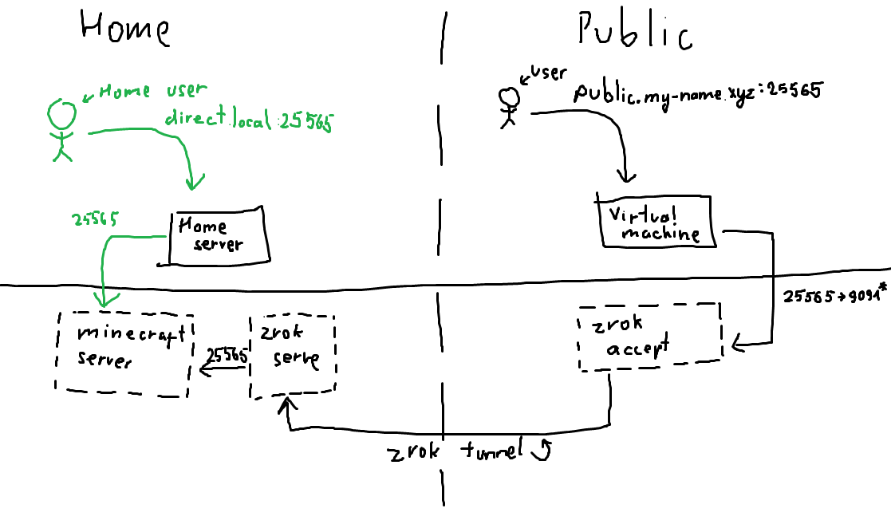
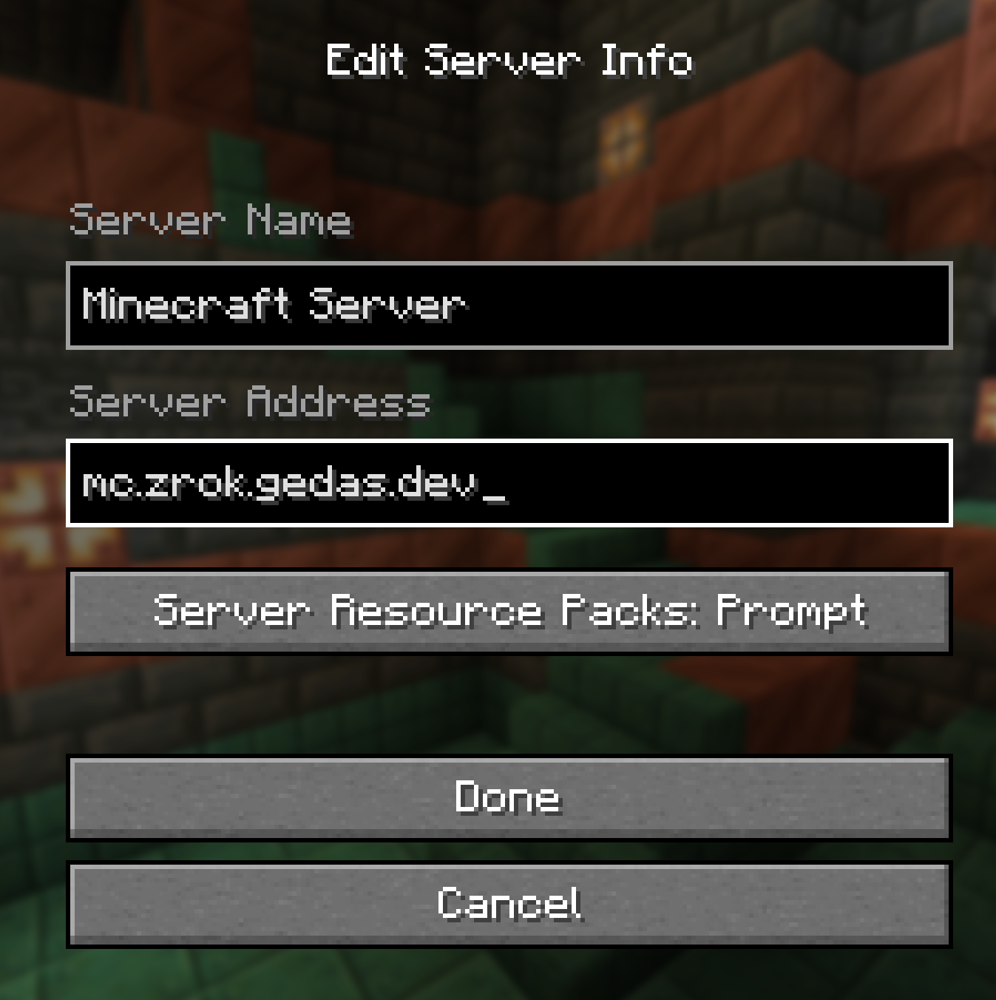
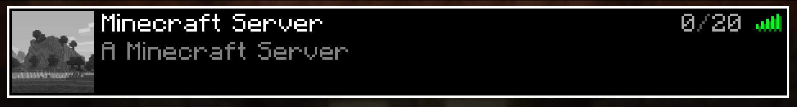
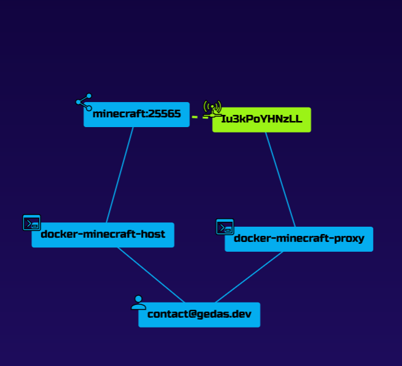

Well the title should really say exposing arbitrary TCP or UDP ports to the internet as this is basically what is being done here.

# Motivation

After [exposing my HTTP web servers to the internet](https://blog.gedas.dev/exposing-minecraft-with-zrok/), I decided what else can I proxy via my virtual machine. How about.. my Minecraft server? :o

Like before, at the end of this procedure I discovered an easier SaaS approach, which I [talk about at the end](#can-we-do-better). If you want a simple one-program-does-it-all solution, just skip to there. If not.. I hope you find this article educational!

# The Plan

Please consult The Diagram™️ for a second:



We currently have a use case where a user can connect to the home server which is running a minecraft server inside Docker. We want other people to connect too, and we can accomplish this via zrok.

The zrok tunnel part really comes down to 2 main components: `share` and `access`. Our home server is going to _share_ to the zrok tunnel a resource (minecraft), and the public virtual machine will _access_ it and expose it publicly. All will also need to be coordinated via zrok API itself. All 3 parts will be discussed individually.

## Setting up zrok

If [zrokNET STARTER plan](https://zrok.io/pricing/) limitations are acceptable, this step can be skipped almost entirely, just make sure you have an account you can `zrok enable` with.

Personally I went with self-hosted approach, mostly as a challenge. The [Docker self-host guide](https://docs.zrok.io/docs/guides/self-hosting/docker/) was excellent and got me to set up most of the system. I never ended up doing caddy https setup, as I already had certificate manager of `traefik` installed on the host, and the whole public share system, while convenient, was not needed.

If you follow the self-hosted approach, follow the guide till you create an account.

### Customizations of the compose.yml

What guide doesn't tell you is that you need to expose the API to the internet for users to connect. That can be done by setting `ZROK_INSECURE_INTERFACE=0.0.0.0` in the `.env` file, or, what i did, was use traefik to expose the service with a TLS certificate.

As a quick refresher, my traefik configuration is as follows:

```yml
# ./compose.yml

services:
  reverse-proxy:
    image: traefik:v3.1
    ports:
      - "443:443"
      - "80:80"
    volumes:
      - /var/run/docker.sock:/var/run/docker.sock
      - ./traefik:/etc/traefik
      - ./letsencrypt:/letsencrypt
    networks:
      - public
    restart: unless-stopped

networks:
  public:
    external: true
    name: public
```

```yml
# ./traefik/traefik.yml

entryPoints:
  web:
    address: ":80"
  websecure:
    address: ":443"

accessLog: {}

providers:
  docker:
    exposedbydefault: false
    network: public
  file:
    directory: /etc/traefik/providers
    watch: true

tls:
  options:
    default:
      sniStrict: true

certificatesResolvers:
  main:
    acme:
      email: YOUR_CONTACT_EMAIL
      storage: /etc/traefik/acme.json
      httpchallenge:
        entrypoint: web
```

The main addition here is that I added a `docker` provider to my traefik setup, and linked everything over a new external network `public` (created with `docker network create public`). This way I can proxy requests across docker compose projects.

With that being said, this is the addition I did to the zrok `compose.yml` file:

```yml
# Changed zrok-controller.networks section to:
    networks:
      zrok-instance:
        aliases:
          - zrok.${ZROK_DNS_ZONE}
      public:

# Added zrok-controller.labels section:
    labels:
      - "traefik.enable=true"
      - "traefik.http.routers.whoami.rule=Host(`api.zrok.gedas.dev`)"
      - "traefik.http.routers.whoami.entrypoints=websecure"
      - "traefik.http.routers.whoami.tls.certresolver=main"
      - "traefik.http.services.zrok.loadbalancer.server.port=18080"

# Updated the end of the file networks config to:
networks:
  zrok-instance:
    driver: bridge
  public:
    external: true
    name: public
```

After doing all this, my api was openable on https://api.zrok.gedas.dev/

## Setting up the private access

Now that we have an account and we have a token to enable environments, the rest is going to be a cake walk!

This section is based from [this guide](https://docs.zrok.io/docs/guides/docker-share/docker_private_share_guide/).

### `share` server

I downloaded the `compose.yml` file [given by the guide](https://docs.zrok.io/zrok-private-share/compose.yml), and edited it to be the following:

```yml
services:
  zrok-init:
    image: busybox
    # matches uid:gid of "ziggy" in zrok container image
    command: chown -Rc 2171:2171 /mnt/.zrok
    user: root
    volumes:
      - ./zrok_env:/mnt/.zrok

  # enable zrok environment
  zrok-enable:
    image: ${ZROK_CONTAINER_IMAGE:-docker.io/openziti/zrok}
    depends_on:
      zrok-init:
        condition: service_completed_successfully
    entrypoint: zrok-enable.bash
    volumes:
      - ./zrok_env:/mnt
    environment:
      HOME: /mnt
      ZROK_ENABLE_TOKEN:
      ZROK_API_ENDPOINT:
      ZROK_ENVIRONMENT_NAME: docker-minecraft-host

  zrok-share:
    image: ${ZROK_CONTAINER_IMAGE:-docker.io/openziti/zrok}
    restart: unless-stopped
    entrypoint: zrok-share.bash
    depends_on:
      zrok-enable:
        condition: service_completed_successfully
    volumes:
      - ./zrok_env:/mnt
    environment:
      # internal configuration
      HOME: /mnt            # zrok homedir in container

      # most relevant options
      ZROK_UNIQUE_NAME:     # name is used to construct frontend domain name, e.g. "myapp" in "myapp.share.zrok.io"
      ZROK_BACKEND_MODE:    # web, caddy, drive, proxy
      ZROK_TARGET:          # backend target, is a path in container filesystem unless proxy mode
      ZROK_INSECURE:        # "--insecure" if proxy target has unverifiable TLS server certificate
      ZROK_BASIC_AUTH:      # username:password
      ZROK_PERMISSION_MODE: # if "closed" allow only your account and additional accounts in ZROK_ACCESS_GRANTS
      ZROK_ACCESS_GRANTS:   # space-separated list of additional zrok account emails to grant access in closed permission mode

      # least relevant options
      ZROK_VERBOSE:           # "--verbose"
      ZROK_SHARE_OPTS:        # additional arguments to "zrok reserve private" command
      ZROK_FRONTEND_MODE: reserved-private
      PFXLOG_NO_JSON: "true"  # suppress JSON logging format

  # demo server you can share with zrok
  minecraft:
    image: itzg/minecraft-server
    environment:
      EULA: "TRUE"
    volumes:
      - ./mc-data:/data
```

It is largely unchanged, except I changed `services.zrok-enable.environment.ZROK_ENVIRONMENT_NAME` to be `docker-minecraft-host`. This is optional to change, but will be easier to identify on the API.

The other (most important) change is I added the actual minecraft server here to share. It could be placed in another compose file, but I would group these 2 things together.

My `.env` file:

```
ZROK_ENABLE_TOKEN="YOUR_ACCOUNT_TOKEN"
ZROK_API_ENDPOINT="https://api.zrok.gedas.dev"
ZROK_UNIQUE_NAME="minecraft1"
ZROK_BACKEND_MODE="tcpTunnel"
ZROK_TARGET="minecraft:25565"
```

Let me explain this file:
1. `ZROK_ENABLE_TOKEN`, this is token you got when you created the account. This can also be seen on API on the top-right context menu.
2. `ZROK_API_ENDPOINT`, optional when not self-hosting, this is the URL to the zrok API.
3. `ZROK_UNIQUE_NAME`, container share key. This can be any lowecase string, but it should be predictable, as it will be used on the receiver side.
4. `ZROK_BACKEND_MODE`, there are many backend modes, such as `http`, `udpClient`, but for minecraft server, we need to set to `tcpTunnel`.
5. `ZROK_TARGET`, this is tunnel destination. Because `minecraft` is on the same compose file, meaning same network too, we can target it directly.

Running the compose file up, will create both minecraft server and will share it to the zrok network.

> **IMPORTANT** To clean up after yourself, before shutting down the environment for the final time, run `sudo docker compose exec zrok-share zrok disable`, before `sudo docker compose down`. If you forget, no big deal, you can manually clean up in the API UI.

### `access` server

We are almost done, just left to set up the access.

This time the docker compose file was changed even less!

```yml
services:
  zrok-init:
    image: busybox
    # matches uid:gid of "ziggy" in zrok container image
    command: chown -Rc 2171:2171 /mnt/.zrok
    user: root
    volumes:
      - ./zrok_env:/mnt/.zrok

  # enable zrok environment
  zrok-enable:
    image: ${ZROK_CONTAINER_IMAGE:-docker.io/openziti/zrok}
    depends_on:
      zrok-init:
        condition: service_completed_successfully
    entrypoint: zrok-enable.bash
    volumes:
      - ./zrok_env:/mnt
    environment:
      HOME: /mnt
      ZROK_ENABLE_TOKEN:
      ZROK_API_ENDPOINT:
      ZROK_ENVIRONMENT_NAME: docker-minecraft-proxy

  zrok-access:
    image: ${ZROK_CONTAINER_IMAGE:-docker.io/openziti/zrok}
    restart: unless-stopped
    command: access private --headless --bind 0.0.0.0:9191 ${ZROK_ACCESS_TOKEN}
    depends_on:
      zrok-enable:
        condition: service_completed_successfully
    ports:
      - 25565:9191  # expose the zrok private access proxy to the Docker host
    volumes:
      - ./zrok_env:/mnt
    environment:
      HOME: /mnt
      PFXLOG_NO_JSON: "true"
```

The only changes here are, again, `services.zrok-enable.environment.ZROK_ENVIRONMENT_NAME` to be something more descriptive, and `services.zrok-access.ports` to select a custom port (22565) to listen to.

The `.env` file is similar to one in step before:

```
ZROK_ENABLE_TOKEN="YOUR_ACCOUNT_TOKEN"
ZROK_API_ENDPOINT="https://api.zrok.gedas.dev"
ZROK_ACCESS_TOKEN="minecraft1"
```

This is where the `ZROK_UNIQUE_NAME` we defined in previous step comes into play. Just make sure `ZROK_ACCESS_TOKEN` matches the value and it will work. The `ZROK_ENABLE_TOKEN`, and `ZROK_API_ENDPOINT`, work identically to previous step.

# Results

When all docker compose projects are up and running, opening minecraft shows that everything works great!




When looking at the API, this is what you should see:



This graph shows:
1. Your user.
2. The host and proxy docker containers.
3. The shared minecraft server resource.
4. The accessed resource via tunnel (dotted line shows the bridge via zrok).

# Can we do better?

Why yes, of course we can. We actually have 2 main "simple" cases.

## SSH Tunnel

If you have a virtual machine you SSH into, you might as well just set up an SSH tunnel. In the past this is what I used to do and it worked out great.

An amazing explanation of SSH tunnels can be found on [Ivan Velichko's blog](https://iximiuz.com/en/posts/ssh-tunnels/).

However if you want a quick and easy solution to host a server, heres a quick command to get you going. Run this in the machine hosting the server.

```bash
ssh -R 0.0.0.0:25566:localhost:25565 user@myhost.xyz
```

> This command sets up so requests coming from any IP address (`0.0.0.0`), hitting the VM's `25566` port, get tunneled to local machine's port `25565`. Adjust ports as needed. Also if your server is on another host, replace `localhost` too.

If you cannot connect to the minecraft server after this, check `/etc/ssh/sshd_config` file, and make sure `GatewayPorts` is set to `clientspecified` or `yes` (not recommended) ([source](https://superuser.com/a/591963)).

It does have some problems though:
1. It only woks with TCP traffic. [There are janky solutions to forward UDP over TCP](https://superuser.com/questions/53103/udp-traffic-through-ssh-tunnel), however I didn't even attempt it.
2. Tunnels eventually close after there has been no activity on them. A tool called `autossh` seems to work great to bypass ([thread](https://superuser.com/questions/37738/how-to-reliably-keep-an-ssh-tunnel-open)), but I wanted a more 'Docker' approach.

## [playit.gg](https://playit.gg/)

Another service we can make use of is playit.gg. They offer proxy services for arbitrary tcp/udp traffic.

I have a blog post about it here: [link](https://blog.gedas.dev/playitgg/).