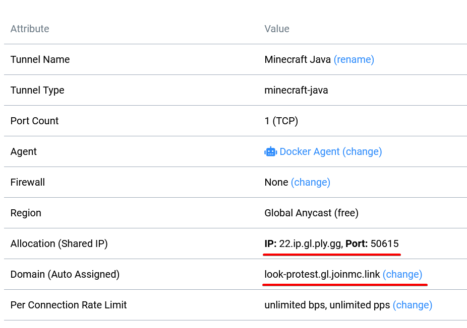
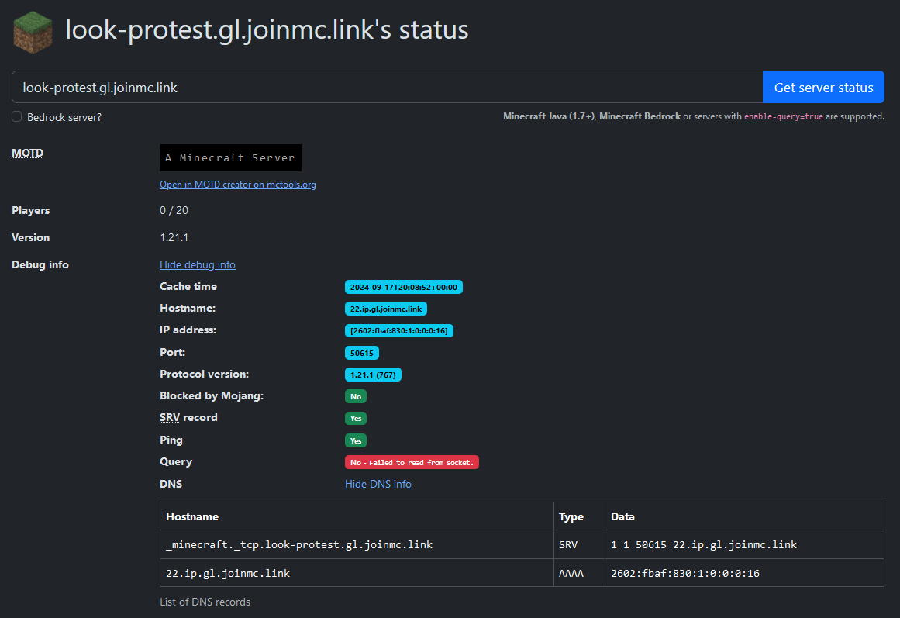

Before today I though connecting to minecraft was as simple as "give IP address and a port, if port not specified, use 25565". Then you can replace the IP with a domain backed with a DNS `A` or `CNAME` record. That is... until I started playing around with [playit.gg](https://playit.gg/).

This service offers a tunnel between your machine and their servers to expose ports to the internet without the need of opening ports.

## So... what happened?

I was playing around and created a tunnel between my machine and and their servers. At first I selected to forward arbitrary TCP traffic. This resulted in the tunnel getting an IP (with a domain) and a port. Simple, straightforward. Connecting to that IP+port combo let me access Minecraft running on my local machine.

The creation process was strange, however. When I attempted to create a server, I could select TCP, but also Minecraft. Intrigued I wanted to see what was up. Maybe it was just a simple configuration helper that just prefilled the port to 25565? When I started the tunnel I was greeted to this:



## Why are there two IP addresses?

Exactly.. why are there two IPs? Putting in both to minecraft.. we connect! No issues! What gives?!

Going by my previous knowledge, we have now 2 IPs we can use to connect to minecraft. Lets put the domain, resolved IP, and the expected port

| Domain                      | IP             | Port      |
| --------------------------- | -------------- | --------- |
| 22.ip.gl.ply.gg             | 147.185.221.22 | 50615     |
| look-protest.gl.joinmc.link | ... none?!     | 25565 (?) |

Yeah so the first IP works exactly as expected, we can even just use the IP:Port combo directly in minecraft and it works identically.

That being said.. imagine my shock when I learnt that the second domain does not resolve to anything! What gives?!

```bash
$ nslookup 22.ip.gl.ply.gg

Server:         127.0.0.53
Address:        127.0.0.53#53

Non-authoritative answer:
Name:   22.ip.gl.ply.gg
Address: 147.185.221.22
Name:   22.ip.gl.ply.gg
Address: 2602:fbaf:85c:1::16


$ nslookup look-protest.gl.joinmc.link

Server:         127.0.0.53
Address:        127.0.0.53#53

Non-authoritative answer:
*** Can't find look-protest.gl.joinmc.link: No answer
```

## So.. what gives?

I had about enough launching and closing minecraft to see if its up, I decided to use [mcsrvstat.us](https://mcsrvstat.us) to look if it can be connected to. And what I thought was going to be a shortcut in my investigation, it blew the case right open. This is what I saw:



Hold on.. SRV record? What does that result?

```bash
$ nslookup -type=SRV _minecraft._tcp.look-protest.gl.joinmc.link
Server:         127.0.0.53
Address:        127.0.0.53#53

Non-authoritative answer:
_minecraft._tcp.look-protest.gl.joinmc.link     service = 1 1 50615 22.ip.gl.joinmc.link.
```

Wait hold on, thats the IP and port we saw earlier? What does this mean?

Based on [very quick research](https://en.wikipedia.org/wiki/SRV_record), I figured out that this record means the following:

| \_service   | \_proto | name                        | priority | weight | port  | target               |
| ----------- | ------- | --------------------------- | -------- | ------ | ----- | -------------------- |
| \_minecraft | \_tcp   | look-protest.gl.joinmc.link | 1        | 1      | 50615 | 22.ip.gl.joinmc.link |

The priority and weight have a meaning when there are multiple results, but in our case they can be ignored. The only thing left is... port and target. That's our answer to the mystery! Minecraft just looks up not only the A record, but also SRV just in case.

## Takeaways

Ultimately what this all means is that if you have 2 minecraft servers running, instead of sending users to connect to `minecraft1.myhost.xyz:25566` you can set up something like the following:

| Record Type | Name                         | Value                           | Connect to server with domain: |
| ----------- | ---------------------------- | ------------------------------- | ------------------------------ |
| A           | minecraft1                   | 192.168.1.101                   | minecraft1.myhost.xyz          |
| SRV         | \_minecraft.\_tcp.minecraft2 | 1 1 22566 minecraft1.myhost.xyz | minecraft2.myhost.xyz          |

This way we can have a bit less numbers in life <3
