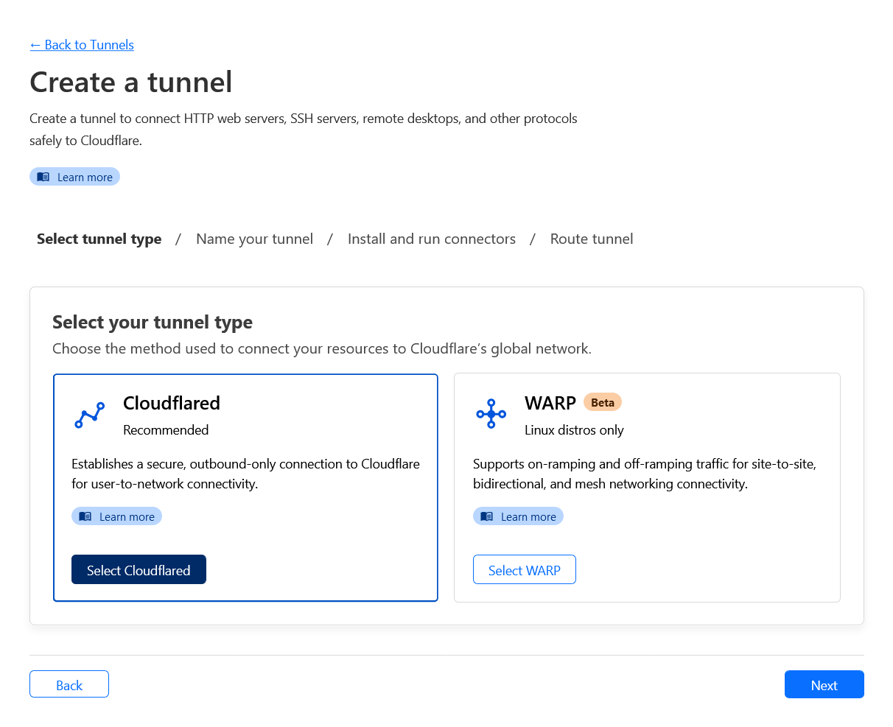
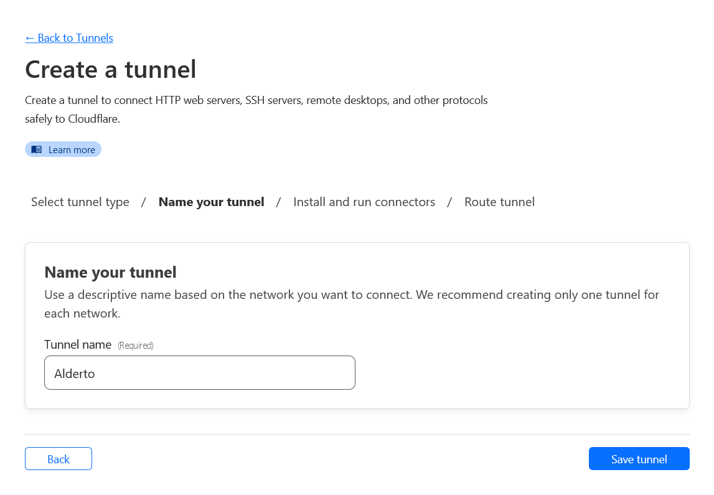
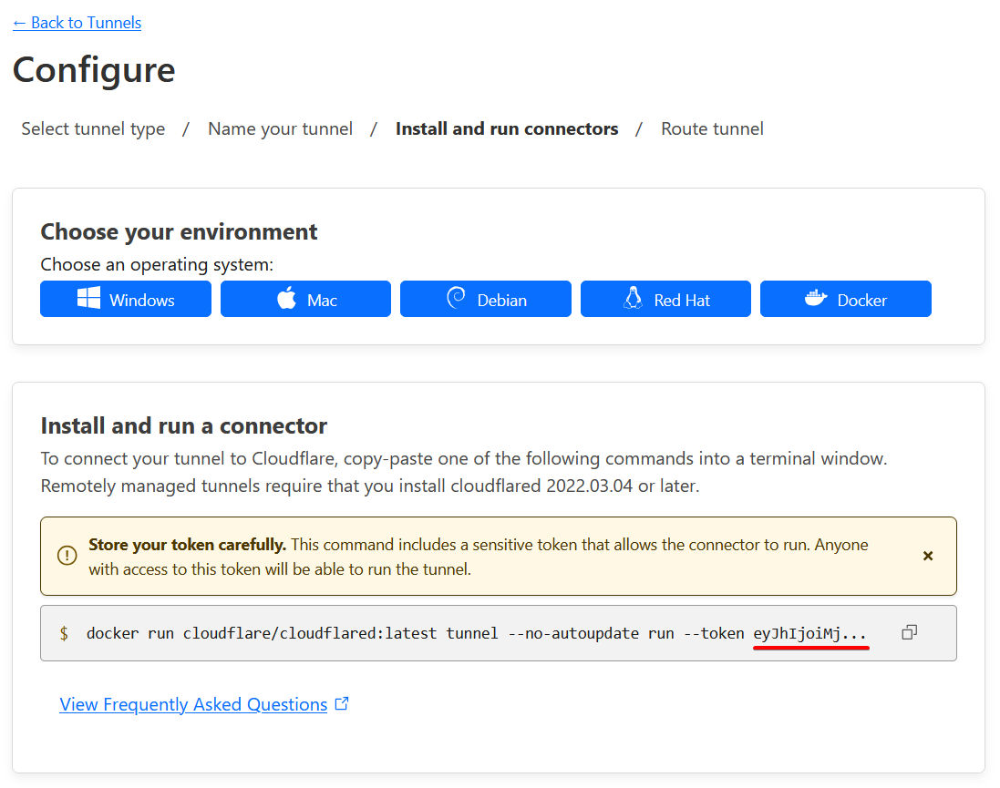
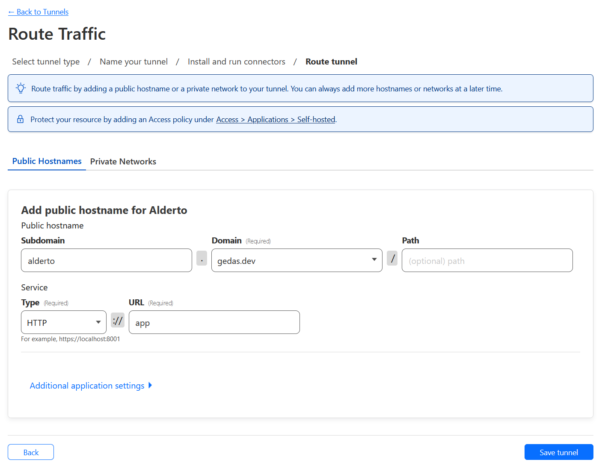
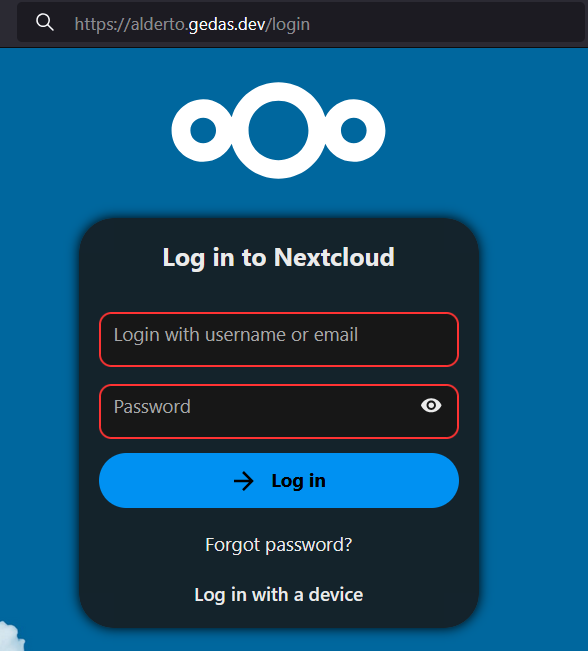

The [Tailscale funnels I setup earlier](./2024-09-15-tailscale-funnel.md) was a fun experiment, but it had way too many moving parts for my liking. I could [move to zrok](./2024-09-16-exposing-minecraft-with-zrok.md) for my web applications (like I did with Minecraft), but I learnt of another product.

A tip I received from a friend (thanks [Rains](https://github.com/AnnoyingRain5)) was to try out [CloudFlare Tunnels](https://www.cloudflare.com/products/tunnel/)!

## What do I need a tunnel for again?

I want to self-host a project I have on my from my local computer, however it cannot be reached publicly due to ISP imposed limitations. A tunnel is like a VPN where it would allow connections regardless if you do or do not have an external IP, by using a computer with a routable IP and then proxying requests.

## What's so special about Cloudflare Tunnels

[My original setup with tailscale funnels](./2024-09-15-tailscale-funnel.md) worked, but it had very big flaws that were bothering me.

For one it was performance. The requests were bouncing all across the world and was taking its sweet time to get to my server. It added latency of ~200ms which was at least noticeable. But the bigger issue I had was just how jank it all was, it had so many fragile moving parts that it could break at any moment. I like my systems working so I opted against it.

The whole janky setup was invented purely to be able to use my own domains instead of ones provided by tailscale. Cloudflare tunnels.. they just let you do it! Free of charge! Don't mind if I do!

## Setting it up

As usual I want to use Docker. While you can create Cloudflare tunnels using CLI, I opted to instead do a couple of clicks on the dashboard. This removed the need to stress about authenticating my CLI client. Sometimes clicking can be good enough :D.

The steps taken here largely follow [this guide from Cloudflare](https://developers.cloudflare.com/cloudflare-one/connections/connect-networks/get-started/create-remote-tunnel/), adapted to use Docker.

### Creating a tunnel

Going to [Cloudflare Zero Trust Dashboard](https://one.dash.cloudflare.com/), tab Networks -> Tunnels, you can create a tunnel.

* Select `cloudflared`, this is the tool we will use. Click Next.



* Name your tunnel. For this guide I will deploy my old project `Alderto`, so will use that as the name. Click Save tunnel.



* Get your token. Cloudflare should have generated a token for you. Select docker and click the marked textbox to copy the command. While the command is useful to run it, we are only interested in the token. Save for later. Click Next.
   
Note that the token is much longer than what is shown on screen :>



* Create routing rules. This section contains 2 parts: public hostname and service
   1) Public hostname requires you to put a subdomain, domain, and a path prefix. You can change this bit to your liking, however for me, all I need is to route all traffic from https://alderto.gedas.dev to my service, so will configure it as such.
   2) Service information is a bit trickier. The service type you will most likely want to be `HTTP`, and the URL, will need to be the same as the service name in the `docker-compose.yml` file. For now I will call it `app`. If your application serves traffic on port other than 80, specify it here. Click Save Tunnel.



### Creating the application

As a sample application for our demo, we will deploy [awesome-compose/nextcloud-postgres](https://github.com/docker/awesome-compose/blob/18f59bdb09ecf520dd5758fbf90dec314baec545/nextcloud-postgres/compose.yaml) example.

I have modified this example slightly to include our new cloudflare container we will use later.

```yml
# ./compose.yml

services:
  app: # Renamed this to app - will match the name of URL in previous step
    image: nextcloud:apache
    environment:
      - POSTGRES_HOST=db
      - POSTGRES_PASSWORD=nextcloud
      - POSTGRES_DB=nextcloud
      - POSTGRES_USER=nextcloud
    restart: always
    volumes:
      - ./nc_data:/var/www/html

  db:
    image: postgres:alpine
    environment:
      - POSTGRES_PASSWORD=nextcloud
      - POSTGRES_DB=nextcloud
      - POSTGRES_USER=nextcloud
    restart: always
    volumes:
      - ./db_data:/var/lib/postgresql/data

  tunnel:
    image: cloudflare/cloudflared:latest
    command: tunnel --no-autoupdate run --token ${CF_TOKEN}
```

Additionally, you can replace the the ${CF_TOKEN} bit with the actual token, or do what I did and just create a `.env` file in the same folder:

```dotenv
# ./.env

CF_TOKEN="eyJhIjoiMj...MY_LONG_TOKEN_VALUE"
```

## Testing it out

Starting up the docker compose project and navigating to the site we set up (https://alderto.gedas.dev/), we see that it works great! We even have https working by default :o



## Hardening the access

There is one extra thing we can do better protect ourselves against attacks. Right now we put the tunnel on the same network as the database, and attackers could route to it. We can prevent that by separating the networks in compose:

```yml
# ./compose.yml

version: "3"

services:
  app: # Renamed this to app - will match the name of URL in previous step
    image: nextcloud:apache
    environment:
      - POSTGRES_HOST=db
      - POSTGRES_PASSWORD=nextcloud
      - POSTGRES_DB=nextcloud
      - POSTGRES_USER=nextcloud
    restart: always
    volumes:
      - ./nc_data:/var/www/html
    networks:
      default:
      cloudflare:

  db:
    image: postgres:alpine
    environment:
      - POSTGRES_PASSWORD=nextcloud
      - POSTGRES_DB=nextcloud
      - POSTGRES_USER=nextcloud
    restart: always
    volumes:
      - ./db_data:/var/lib/postgresql/data

  tunnel:
    image: cloudflare/cloudflared:latest
    command: tunnel --no-autoupdate run --token ${CF_TOKEN}
    networks:
      cloudflare:

networks:
  cloudflare:
```

By default `docker compose` creates a `default` bridge network for all projects that do not have networks defined explicitly.

In this configuration:

1. `app` can be accessed from `tunnel` and can reach `db`
2. `tunnel` cannot reach `db` as they do not share a network.

We can verify it via a simple ping. We will temporarily add a new service `box` in the `network_mode` of `tunnel` service so we have access to some network tools.

```yml
  box:
    image: busybox
    entrypoint: sleep 1000000
    network_mode: service:tunnel
```

```
$ sudo docker compose exec -it box ping -c 1 app
PING app (192.168.176.2): 56 data bytes
64 bytes from 192.168.176.2: seq=0 ttl=64 time=0.107 ms

--- app ping statistics ---
1 packets transmitted, 1 packets received, 0% packet loss
round-trip min/avg/max = 0.107/0.107/0.107 ms


$ sudo docker compose exec -it box ping -c 1 db
ping: bad address 'db'
```

Here `db` does not resolve, but even if we manually specify the IP of the `db` service we won't get any results.

## Closing Thoughts

I really like this setup as you do not need to manage a centralized place to manage your routing. Much like Traefik could use labels on containers to configure routing and keep all rules in the project, here we setup the tunnel daemon in the project itself. This way if you want to shut it down, `docker compose down` will tear down the tunnel connection as well. The DNS records would need to be adjusted manually, but its not that big of a deal.

Unlike my previous attempts at proxying, I really like this, as it does not require me to rent a Virtual Machine, and it does not have the janky bodged feeling to it!
