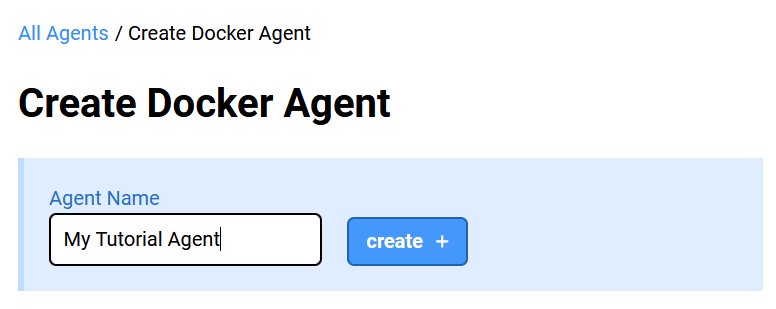
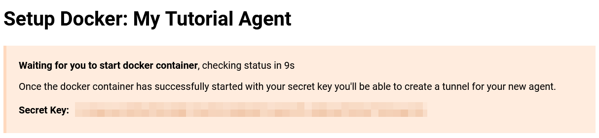
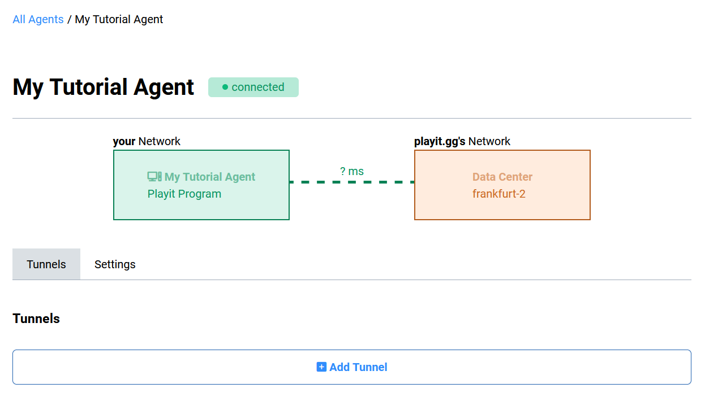
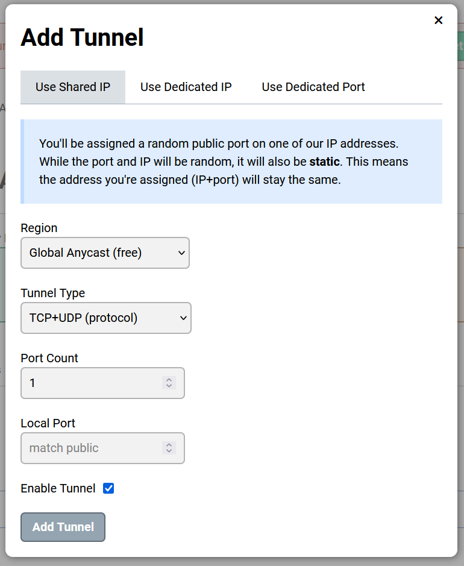
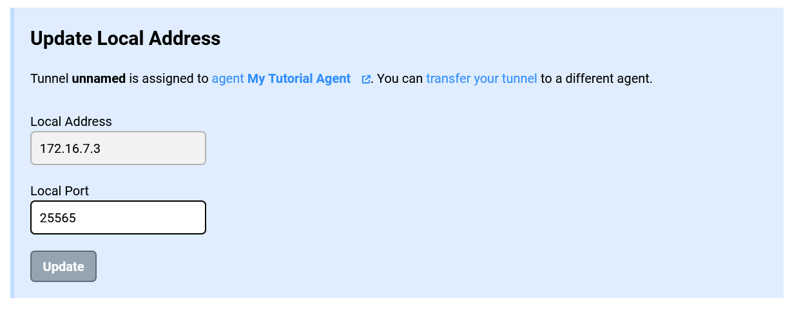
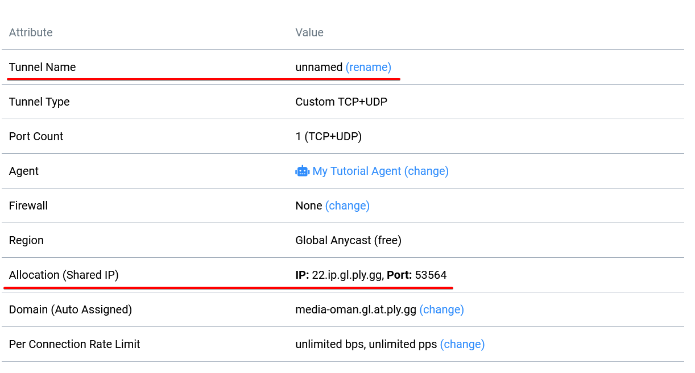
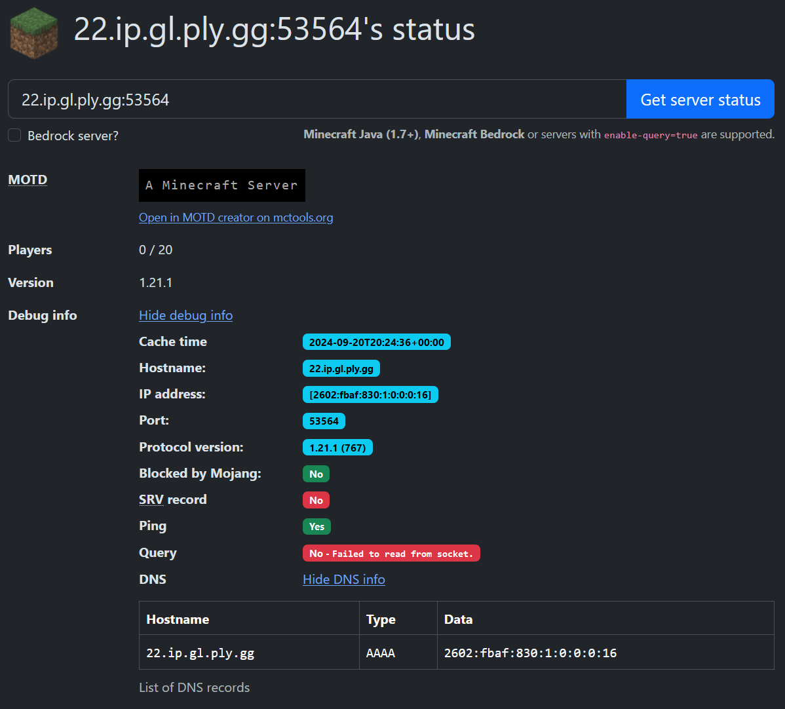

[After moving](./2024-09-19-cloudflare-tunnels.md) to a more permanent, more professional-feeling solution for my home server HTTP traffic in the form of [Cloudflare Tunnels](https://www.cloudflare.com/products/tunnel/), I set my eyes on the cost effectiveness of my Virtual Machine.

I needed to face reality. I was paying a monthly fee to let my friends access my Minecraft server. I know I can do better. So I tried. I tried a service I was vaguely aware of for quite some time now - [playit.gg](https://playit.gg/).

## What does this service provide?

My home server does not have a routable IP address. I cannot have a website or a Minecraft server people can join. This issue is also not fixable using port-forwarding, as my "external" IP is just part of my ISP's bigger internal network.

The 3 ways people could access the server:

1. Be on same network (LAN). This is obvious that it will work, but also has an issue I hopefully should not need to explain :D.
2. Be on the same VPN network. For reference, that's how Hamachi works! The downside of this approach is you need to have people install some software on the computer to join. Not a big deal generally, but also I wanna do better.
3. Set up a publicly routable server to proxy requests to you over some form of tunnel. It can be VPN based, SSH based, or even some other protocol. `zrok` I used in the past uses `OpenZiti` which uses an overlay network to route traffic.

The playit.gg service offers the 3rd approach. I am not too familiar with the implementation details, but in some form, a tunnel is created between their servers and your machine, which proxies requests from internet. In my case, the target of the proxy is a Docker container running a Minecraft server.

## The setup

We will be creating a simple tunnel that proxies arbitrary TCP traffic to a container on a Docker network. We will also use the Docker playit agent.

### Provisioning an IP range

Okay so this might feel a bit random for the first step, but bear with me, there is no better time to do this than now. Playit agents do not have DNS resolution functionality for their routing. They allow for localhost and static IP addresses. So let's create a static IP network!

```
$ sudo docker network create playit
8e723745db2e0aab807c6590176618064bbb3db40097448be7801edc01e811d9

$ sudo docker network inspect playit
[
    {
        "Name": "playit",
        ...
        "IPAM": {
            "Driver": "default",
            "Options": {},
            "Config": [
                {
                    "Subnet": "172.16.7.0/24",
                    "Gateway": "172.16.7.1"
                }
            ]
        },
        ...
    }
]
```

For static IP provisioning to work we need to manually define both subnet and gateway. We can manually look for one, or we can just let docker create one for us, and then delete it so we can recreate it with the same parameters but ✨manually✨.

After running the creation network command, the network (subnet) I was given is `172.16.7.0/24`, with a gateway of `172.16.7.1`. We will delete this and recreate it with the following commands:

```
$ sudo docker network rm playit
playit

$ sudo docker network create --subnet 172.16.7.0/24 --gateway 172.16.7.1 playit
d01e32c00bc1ba7f572e2408af649899008f670bbfbf2b56b0a0e61d88aea398
```

Now we have a network we can use for later.

### The Docker Compose Project

Now that we have a dedicated network, we can start with the `docker compose` project. See the example as follows:

```yml
# ./compose.yml

services:
  minecraft:
    image: itzg/minecraft-server
    environment:
      EULA: "TRUE"
    volumes:
      - ./data:/data
    networks:
      playit:
        ipv4_address: 172.16.7.3

  playit:
    image: ghcr.io/playit-cloud/playit-agent:0.15
    environment:
      SECRET_KEY: ${SECRET_KEY}
    networks:
      playit:
        ipv4_address: 172.16.7.2

networks:
  playit: # 172.16.7.0/24
    external: true
```

Usually you will not need to manually define an IP address to a container, but this is not an usual case, so we have to live with it. Since we defined network `playit` externally, we import it on the `networks` top level compose property. I left a comment there for future me to remember what network its part of.

Later I assigned IP addresses to each container manually. I decided to give `X.X.X.2` (reminder: 1 is reserved for gateway) to the agent, and then just gave minecraft the next one: `X.X.X.3`. Future servers will just increment this number (or reuse if I get bored and close down the servers).

### Creating the Agent

We cannot run the compose project just yet, we need to provide a `SECRET_KEY`. You can get it on the playit.gg dashboard.

After creating an account on [https://playit.gg/](https://playit.gg/), we can add a new agent. For this tutorial I will show the example with [a docker agent](https://playit.gg/account/agents/new-docker).

**(1)** Create an agent and give it a name (optional). For my example I will create `My Tutorial Agent`.



**(2)** Grab the Secret Key and put it to the `.env` file in same folder with `compose.yml`:

```env
# ./.env

SECRET_KEY="LALALAALMY_SECRET_KEY_LALALAL"
```

The tutorial will now suggest you use `host` networking mode. It would work, especially with port forwarding, however this tutorial will use independent networks.



## Running The project

If all is configured correctly, executing `docker compose up -d`, will start everything up. If all is green - go to [Continuing Setup - playit.gg](#continuing-setup---playitgg), otherwise follow steps on [Troubleshooting](#troubleshooting).

### Troubleshooting

Here are some of the mistakes you might encounter, and how to fix them. If you have not encountered issues and everything started, move on to the [next step](#continuing-setup---playitgg).

```
$ sudo docker compose up
Error response from daemon: user specified IP address is supported only when connecting to networks with user configured subnets
```

If you got this error message, you have not "manually" configured a subnet. Follow the steps on [Provisioning an IP range](#provisioning-an-ip-range) chapter **carefully**.


```
$ sudo docker compose up
Error response from daemon: Address already in use
```

If you got this error message, you have a duplicating IP address. You should start numbering your IP addresses from 2. You cannot use 1, as it is reserved for the gateway.

I would recommend allocating `X.X.X.2` for the `playit` agent, and then going `X.X.X.3`, `X.X.X.4`... for actual containers.

## Continuing Setup - playit.gg

Once your docker services started up, your browser should now look a little something like this:



**(3)** Click `Add Tunnel`.

**(4)** You will be presented with a choice to create a tunnel. For most game servers you will need to create a TCP tunnel, however a few (such as Core Keeper) uses UDP. You can select `TCP+UDP (protocol)` if you are unsure and leave it at that. 

Note: even though there are game options like `Minecraft Java`, they are just flavor. You can select them, but its unnecessary - vanilla TCP/UDP works just fine!

Click `Add Tunnel`.



**(5)** Now you will see an option to configure the Local Address of the Tunnel. You will need to change the address to the **container IP that runs the server (Minecraft)**. Its the IP we assigned manually, and in my case its `172.16.7.3`. The port of Minecraft servers is `25565`, so we set it to that too.

Click `Update`.



**(6)** Underneath you will find the following table:



Feel free to change the `Tunnel Name` to something more recognizable. It does not have any impact, but it will look nicer on the playit.gg dashboard.

**(7)** On the same table you will also find `Allocation (Shared IP)`. This is your IP:port you will put into Minecraft to connect to the server from outside - give this to your friends!

To verify it working we use https://mcsrvstat.us:



Congratulations! You have successfully opened a minecraft server to the world!

## Tips and Tricks

### Do I have to remember the IP addresses?

Thankfully, not all that much! If you ever encounter an issue of address being in use, you can always use this command to investigate which containers are hoarding the IP address:

```
$ sudo docker network inspect playit
[
    {
        "Name": "playit",
        ...
        "Containers": {
            "0c5afa77a4d293b3f6a2288706b5ab89907c291e246df3ec3ec6c93349695266": {
                "Name": "demo3-playit-1",
                "EndpointID": "0e5e062075376ff5c3df635492b230eab9b95a8b1fd29a5dc233184caf0ec04a",
                "MacAddress": "02:42:ac:10:07:02",
                "IPv4Address": "172.16.7.2/24",
                "IPv6Address": ""
            },
            "371b84f448460c3481e384b72c3451bb7dbf11e761ebc16dc2505d564ccbc529": {
                "Name": "demo3-minecraft-1",
                "EndpointID": "099531bf0dc373183e724a444f8b2e749f36cec7cc2586d28f6928b81df0672e",
                "MacAddress": "02:42:ac:10:07:03",
                "IPv4Address": "172.16.7.3/24",
                "IPv6Address": ""
            }
        },
        ...
    }
]
```

From the above inspect we see that `demo3-playit-1` has `172.16.7.2/24`, and `demo3-minecraft-1` has `172.16.7.3/24` assigned to them.

### Reusing the Agent

In my final setup I separated the agent into its own docker compose project so I could reuse it later. As we created the network externally it was very straight forward to do!

```yml
# ./playit-agent/compose.yml

  playit:
    image: ghcr.io/playit-cloud/playit-agent:0.15
    environment:
      SECRET_KEY: ${SECRET_KEY}
    networks:
      playit:
        ipv4_address: 172.16.7.2

networks:
  playit: # 172.16.7.0/24
    external: true
```

```yml
# ./minecraft/compose.yml

services:
  minecraft:
    image: itzg/minecraft-server
    environment:
      EULA: "TRUE"
    volumes:
      - ./data:/data
    networks:
      playit:
        ipv4_address: 172.16.7.3

networks:
  playit: # 172.16.7.0/24
    external: true
```

The playit.gg service Free plan restricts you to only 2 agents to be in use. Normally that's okay, but for docker we would need a lot of agents. I saw we could reuse the `SECRET_KEY` value across multiple containers, but that might lead to unpredictable results. Use caution.

### Using your own domain for a server

I have covered this previously! See [SRV Records: how Minecraft finds where to connect](./2024-09-17-minecraft-srv-records.md).